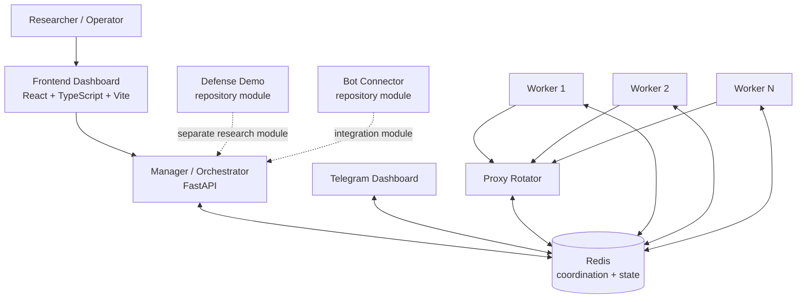

# Architecture: Implemented vs. Target Design

This document exists to keep the portfolio technically honest. It separates components that are verifiable in the repository today from components that appear in design / roadmap material but are not part of the root runtime configuration.

## 1. Current implemented architecture

### Verified from repository structure and root Docker Compose

### Runtime boundary

The root `docker-compose.yml` currently defines:

- `redis`
- `proxy-rotator`
- `manager`
- `telegram-dashboard`
- `worker` with multiple replicas

The frontend is compiled in the manager Docker build and served as static dashboard assets.

`defense-demo` and `bot-connector` are present in the repository, but they should not be described as root Compose services unless / until they are wired into that runtime configuration.

## 2. Component responsibilities

### Manager / Orchestrator

Implemented responsibilities include orchestration and operator-facing API behavior. Security-sensitive administrative functions should remain fail-closed and require explicit operator authorization.

### Redis

Used for coordination / state sharing between manager, workers, and related services in the current lab topology.

### Workers

Controlled research workers used for browser/session and automation experiments in authorized lab environments.

### Proxy Rotator

Research component for managing proxy-pool behavior and request distribution. It is not evidence of any third party's internal network design.

### Frontend Dashboard

React/TypeScript interface for research visibility and operator control.

### Telegram Dashboard

Operational notification / control integration connected to the lab environment.

### Defense Demo

A defensive simulation module for experimenting with concepts such as rate limiting, behavioral signals, fraud scoring, and queue / payment-stage controls.

### Bot Connector

Integration-oriented research module. Its presence should be described as a lab connector rather than a production integration unless separately verified.

## 3. Target / conceptual architecture

Some architecture material for this project includes components such as:

- PostgreSQL
- Redis primary / secondary topology
- Nginx / reverse proxy
- Prometheus
- Loki / ELK
- centralized backup / recovery
- expanded API gateway and analytics services

These are reasonable future design directions, but they **must not be presented as implemented runtime components until they exist in code / deployment configuration and have been validated**.

Recommended labels for diagrams:

- `CURRENT IMPLEMENTED ARCHITECTURE` — only components verified in the repository/runtime.
- `TARGET / FUTURE ARCHITECTURE` — planned components and scaling design.

Never combine the two without an explicit legend.

## 4. Third-party architecture claims

The simulator may be informed by passive OSINT research into public-facing ticketing platforms. That research can support statements such as:

- a queue or waiting-room behavior was publicly observable;
- a client-side artifact or HTTP response indicated a particular vendor or control family;
- public documentation described a relevant defensive mechanism.

It does **not** support claims that the simulator reproduces a third party's private source code, internal service topology, private detection rules, or confidential configuration.

Use the evidence classes defined in the README:

- **Observed**
- **Inferred**
- **Simulated**

## 5. Portfolio review rule

Before adding an architecture component to the public diagram, require at least one of:

1. source code in the repository;
2. deployment / Compose / infrastructure configuration;
3. an executable local demonstration;
4. documentation that explicitly labels the component as target / future design.

This keeps the visual architecture aligned with evidence.
