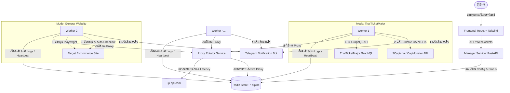

# รายงานระบบ TTM Concert & Universal Purchase Bot 2026 (Production Version)

เอกสารฉบับนี้สรุปโครงสร้างสถาปัตยกรรม (Architecture), โหมดการทำงาน (Operation Modes), ส่วนประกอบของระบบ (Components), การเชื่อมต่อระหว่างบริการ (Service Orchestration) และกลไกของระบบบอทกดบัตรและสั่งซื้อสินค้าอัตโนมัติเวอร์ชันปรับปรุงป 2026 ที่ผ่านการอัปเกรดให้สามารถใช้งานแบบทั่วไป (Generalized) ได้ทั้งเว็บบันเทิงและเว็บพาณิชย์อิเล็กทรอนิกส์ทั่วไป

---

## 1. สถาปัตยกรรมระบบโดยรวม (System Architecture)

ระบบถูกออกแบบในรูปแบบ **Distributed Manager-Worker Architecture** โดยมี **Redis** เป็นศูนย์กลางการควบคุมสถานะ (Shared State) และประสานงานระหว่างโหนด ตัวระบบรองรับโหมดการทำงานสองรูปแบบหลัก โดยใช้ **Proxy Rotator** ในการคัดกรองและสลับ IP เพื่อหลบเลี่ยงการบล็อกจาก Cloudflare/Queue-it และลดความเสี่ยงจากการระบุลายนิ้วมือเบราว์เซอร์ (Browser Fingerprinting และ ApiFingerprinting)

---

## 2. โหมดการทำงานหลัก (System Operation Modes)

ผู้ใช้งานสามารถสลับโหมดการทำงานได้โดยตรงผ่านทางหน้าจอตั้งค่าของ GUI Dashboard ซึ่งระบบจะสลับกลไกและฟังก์ชันการประมวลผลภายใน Worker ดังนี้:

### 2.1. โหมด ThaiTicketMajor (GraphQL Bypass)
* **รูปแบบ**: ยิง Request ไปยัง GraphQL API ของ ThaiTicketMajor (`https://api.thaiticketmajor.com/graphql/v2`) โดยตรง ไม่ผ่านหน้าเว็บเบราว์เซอร์หลัก ส่งผลให้มีความเร็วระดับมิลลิวินาที
* **จุดเด่น**:
  * **Background Token Warmup**: ระบบจะรันคอรันทีนเบื้องหลัง คอยดึง Turnstile CAPTCHA ไปถอดรหัสผ่านบริการ 2Captcha/CapMonster และแคชโทเค็นข้ามคิว (Queue-it Token Bypass) เก็บไว้ใน Redis ล่วงหน้า ทำให้เมื่อถึงเวลาเปิดขายจริง บอทสามารถกระโดดข้ามหน้าคิวได้ทันที
  * **Concurrent Purchase Wave**: สุ่มดึงโปรไฟล์ผู้ซื้อที่ตั้งค่าไว้และยิงคำสั่งซื้อ (`addToCart` และ `checkout` mutations) แบบขนานตามระดับสิทธิ์ความสำคัญของบัตร (Ticket Priorities) เช่น VIP > GA

### 2.2. โหมด General Website (Browser Automation)
* **รูปแบบ**: ใช้ไลบรารี **Playwright** เปิดเบราว์เซอร์จำลอง (Chromium ในโหมด Headless) เพื่อโหลดหน้าเว็บสินค้าและจำลองการคลิกแบบอัตโนมัติ สำหรับใช้งานกับเว็บขายของเล่น (เช่น Pop Mart), รองเท้าแบรนด์เนม หรือเว็บ E-commerce อื่นๆ
* **จุดเด่น**:
  * **Refresh Modes**:
    * `auto_refresh`: ทำการรีโหลดหน้าเว็บใหม่ตามระยะเวลาที่กำหนด (`refresh_interval`) จนกว่าจะเจอปุ่มที่เปิดให้กดสั่งซื้อ
    * `dom_watch`: เฝ้าดูการเปลี่ยนแปลงขององค์ประกอบ (DOM) บนหน้าเว็บเดิมโดยไม่โหลดหน้าใหม่ เพื่อตรวจจับปุ่มเปลี่ยนสถานะจาก Disabled เป็น Active
  * **Action After Click**:
    * `notify`: เมื่อคลิกปุ่มสั่งซื้อหรือใส่ตะกร้าสำเร็จ จะแจ้งเตือนเข้า Telegram และหยุดเพื่อให้ผู้ใช้เข้าควบคุมเบราว์เซอร์ต่อด้วยตนเอง (Takeover)
    * `auto_checkout`: ดึงข้อมูลโปรไฟล์ผู้ซื้อรายแรก (Buyer Profile) เช่น อีเมล, เบอร์โทร, ที่อยู่, ข้อมูลบัตรเครดิต มาทำการกรอกลงในฟอร์มหน้าสั่งซื้อแบบอัตโนมัติ (Best-effort Form Filling) และทำรายการสั่งซื้อทันที

---

## 3. ส่วนประกอบย่อยของระบบ (Components Breakdown)

### 3.1. Redis Store (ตัวเก็บข้อมูลสถานะ)
ทำหน้าที่ประสานงานข้อมูลของบริการทั้งหมด:
* `ttm:config`: จัดเก็บคอนฟิกระบบที่ถูกบันทึกมาจากหน้า GUI
* `ttm:command`: ค่าสถานะสั่งเริ่ม/หยุดงานบอท (`start` / `stop`)
* `ttm:global_stop`: สัญญาณอินเตอร์รัปต์หลัก เมื่อบอทตัวใดตัวหนึ่งซื้อสำเร็จ จะตั้งค่านี้เป็น `1` เพื่อสั่งให้ทุกบอทหยุดยิงเซสชันทันที ป้องกันการจ่ายเงินซ้ำซ้อน
* `ttm:logs`: คิวเก็บประวัติการทำงาน 100 บรรทัดล่าสุดสำหรับส่งแสดงผลแบบสด

### 3.2. Proxy Rotator Service (บริการจัดการเครือข่าย)
* **ISP Filter**: กรอง IP ที่มาจากเครื่องโฮสติ้งสาธารณะ (Datacenter IP เช่น AWS, Google Cloud) ออกไป เพื่อใช้เพียง Resident Proxy ของไทยที่มีคุณภาพสูงและเป็นไอพีบ้านจริง
* **Lease System**: แจกจ่ายสิทธิ์การใช้งาน Proxy ให้กับ Worker แต่ละตัว (`LEASE_TTL = 45s`) เพื่อป้องกันไม่ให้ IP เดียวกันถูกใช้งานซ้ำซ้อนพร้อมกันในระดับวินาทีจนโดนแบน

### 3.3. Manager Service (แอปพลิเคชันส่วนกลาง)
* พัฒนาด้วย FastAPI ให้บริการ REST API แก่ Frontend และบรอดแคสต์ Logs ผ่าน **WebSockets (`/ws/logs`)**
* มีระบบ `LocalRedis` จำลองสำหรับเก็บข้อมูลสำรองชั่วคราวกรณี Redis หลักตัดการเชื่อมต่อ

### 3.4. Worker Service (เครื่องจักรจองซื้อ)
* พัฒนาด้วย Python 3.11 + Playwright/GraphQL
* มีระบบสร้างลายนิ้วมือเบราว์เซอร์อัตโนมัติ (**Antidetect Fingerprint Generator**) ทำการจำลองค่าสุ่มอย่างคงที่ตาม IP Proxy (Deterministic Seed) เช่น User-Agent, Viewport, WebGL Renderer, และจำนวนคอร์ของ CPU เพื่อสร้างความน่าเชื่อถือให้กับเซสชันการสั่งซื้อ

---

## 4. แผนที่โปรเจกต์และตำแหน่งไฟล์สำคัญ (Project File Map)

โครงสร้างและตำแหน่งของโค้ดหลักในโปรเจกต์มีดังนี้:

| บริการ / ส่วนงาน | พาธของไฟล์ (File Path) | หน้าที่และความรับผิดชอบหลัก |
| :--- | :--- | :--- |
| **Global Infrastructure** | [docker-compose.yml](file:///c:/Users/jerks/OneDrive/Desktop/ttm-bot-2026/docker-compose.yml) | ไฟล์ตั้งค่าและควบคุม Docker Containers ทั้งหมด (Redis, Rotator, Manager, Worker) |
| **Proxy Management** | [proxy-rotator/main.py](file:///c:/Users/jerks/OneDrive/Desktop/ttm-bot-2026/proxy-rotator/main.py) | ตรวจสอบ IP, แยกประเภทโฮสติ้ง, จัดสรร IP สลับหมุนเวียน |
| **Dashboard Backend** | [manager/main.py](file:///c:/Users/jerks/OneDrive/Desktop/ttm-bot-2026/manager/main.py) | หลังบ้าน Dashboard, ให้บริการ WebSocket Logs และ API คอนฟิก |
| **Dashboard Frontend** | [frontend/src/components/Setup.tsx](file:///c:/Users/jerks/OneDrive/Desktop/ttm-bot-2026/frontend/src/components/Setup.tsx) | ฟอร์มตั้งค่า GUI Dashboard รองรับการเปลี่ยนโหมดและบันทึกลงฐานข้อมูล |
| **Dashboard Frontend** | [frontend/src/components/Dashboard.tsx](file:///c:/Users/jerks/OneDrive/Desktop/ttm-bot-2026/frontend/src/components/Dashboard.tsx) | หน้าควบคุมสถานะการทำงานบอทแบบเรียลไทม์ |
| **Dashboard Frontend** | [frontend/src/components/BrowserProfiles.tsx](file:///c:/Users/jerks/OneDrive/Desktop/ttm-bot-2026/frontend/src/components/BrowserProfiles.tsx) | หน้าจอจำลองข้อมูลลายนิ้วมือเบราว์เซอร์และฮาร์ดแวร์ |
| **Bot Worker Logic** | [worker/bot.py](file:///c:/Users/jerks/OneDrive/Desktop/ttm-bot-2026/worker/bot.py) | ตัวทำงานบอทหลัก สลับโหมดประมวลผลระหว่าง GraphQL API และ Playwright Browser |
| **User Manual** | [คู่มือการใช้งานบอทกดบัตร ThaiTicket.txt](file:///c:/Users/jerks/OneDrive/Desktop/ttm-bot-2026/คู่มือการใช้งานบอทกดบัตร%20ThaiTicket.txt) | เอกสารแนะนำการติดตั้ง การตั้งค่า และเทคนิคการกดบัตร |

---

## 5. ข้อได้เปรียบและคุณลักษณะเด่นทางเทคนิค (Technical Advantages)

1. **Dual-Mode Versatility**: รองรับทั้งการกดแบบยิง GraphQL ความเร็วสูง (สำหรับหน้าจองคอนเสิร์ตปกติ) และการใช้เว็บเบราว์เซอร์จริงประมวลผลหน้าเว็บปลายทาง (สำหรับเว็บทั่วไปที่มีระบบตรวจบอทหนาแน่น)
2. **Best-Effort Form Filler**: อัปเกรดฟังก์ชันวิเคราะห์ช่องกรอกข้อมูล โดยใช้ Playwright ค้นหาฟิลด์ชื่อ, นามสกุล, เบอร์โทร, และหมายเลขบัตรเครดิตแบบอัจฉริยะเพื่อเติมข้อมูลและกดเช็คเอาต์ได้ทันที
3. **Anti-Detect Consistency**: จำลองสภาพแวดล้อมระบบปฏิบัติการและอุปกรณ์จริง (เช่น การจำลองการ์ดจอ NVIDIA/AMD และขนาดหน้าจอที่แตกต่างกัน) โดยเชื่อมข้อมูลลายนิ้วมือเข้ากับ Proxy ตัวเดิมอย่างสม่ำเสมอ หลบเลี่ยงตัวจับความผิดปกติของ Cloudflare
4. **Instant Telegram Feedback**: ระบบจะส่งข้อความแจ้งเตือนทันทีที่มีบอทตัวใดตัวหนึ่งผ่านด่านคิวหรือทำรายการสั่งซื้อสำเร็จ พร้อมส่งลิงก์เพื่อให้คนเข้าไปชำระเงินต่อได้สะดวก
